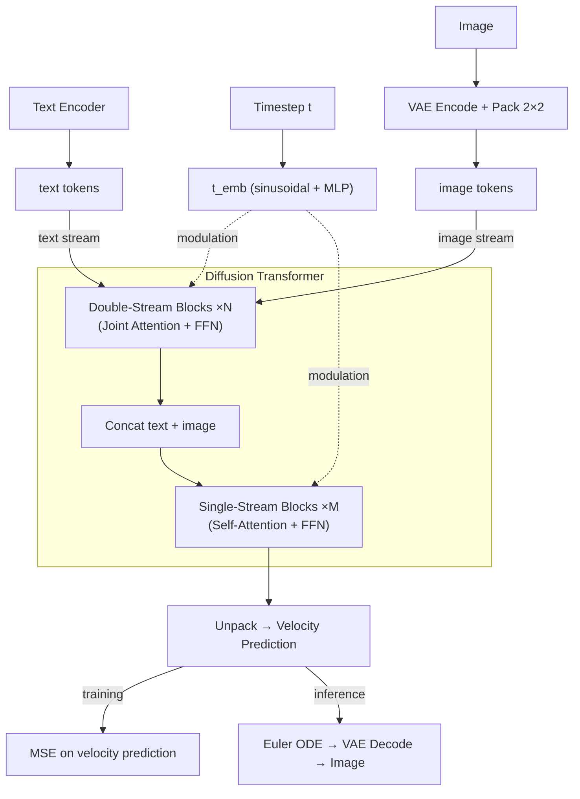

# minFLUX

A minimal implementation of key components of [FLUX](https://bfl.ai/models/flux-2) diffusion transformers. minFLUX tries to be small, clean, interpretable and educational. Since the design space of diffusion models is huge, the purpose of minFLUX is to understand the key model choices in FLUX. minFLUX is also unique in that it is the only implementation of FLUX that is verifiable by referencing the official codebases.

The transformer architectures and algorithms are inferred from the official [diffusers](https://github.com/huggingface/diffusers/tree/cbf4d9a3c384ef97d6b0e40c9846dd9e0e41886a) repo. The VAE comes from the BFL reference implementations ([flux](https://github.com/black-forest-labs/flux/tree/802fb4713906133fcbd0d8dc5351620ca4773036), [flux2](https://github.com/black-forest-labs/flux2/tree/50fe5162777813d869182b139e83b10743caef15)). Each `.py` file has a companion `.md` file mapping every function to exact source lines at pinned commits. This extensive line-by-line source mapping makes minFLUX credible and verifiable.

## Diffusion Equations

**Training** (rectified flow matching):

$$x_t = (1 - \sigma(t)) \cdot x_0 + \sigma(t) \cdot \epsilon \qquad \text{(noisy input)}$$

$$v = \epsilon - x_0 \qquad \text{(velocity prediction)}$$

$$L = \left\| model(x_t, t) - v \right\|^2 \qquad \text{(MSE loss)}$$

**Inference** (Euler ODE step):

$$x_{t_{\text{next}}} = x_t + (\sigma(t_{\text{next}}) - \sigma(t)) \cdot model(x_t, t)$$

## FLUX Architecture

Block details: [FLUX.1 double/single-stream blocks](flux1/model.md#key-design-choices) | [FLUX.2 block differences](flux2/model.md)

## FLUX.1 vs FLUX.2

| | FLUX.1 | FLUX.2 |
|---|--------|--------|
| Text encoder | CLIP + T5 | Mistral3 |
| VAE z_channels | 16 | 32 |
| VAE normalization | scale/shift | Patchify (2x2) + BatchNorm |
| FFN | GELU | SwiGLU |
| Modulation | Per-block AdaLN | Shared across blocks |
| RoPE | theta=10000, 3 axes | theta=2000, 4 axes |
| Blocks | 19 double + 38 single | 8 double + 48 single |

## Contributing

Contributions are welcome, especially for:

- **Source-of-truth**: cross-reference code against [diffusers](https://github.com/huggingface/diffusers), [flux](https://github.com/black-forest-labs/flux), and [flux2](https://github.com/black-forest-labs/flux2) and fix any implementation discrepancies
- **Documentation**: improve the companion `.md` files and update line mappings when diffusers changes
- **New architectures**: add new FLUX variants following the `flux1/` / `flux2/` pattern (each `.py` with a companion `.md`)

## Disclaimer

Since minFLUX is inferred from the official diffusers and BFL repos, the possible sources of inaccuracies in the code can be:

- **AI-assisted**: The code is written with the help of AI, referencing the diffusers and BFL repos. It was verified line-by-line against the source but not executed end-to-end.
- **Upstream code changes**: Source-of-truth line numbers reference specific commits ([diffusers](https://github.com/huggingface/diffusers/tree/cbf4d9a3c384ef97d6b0e40c9846dd9e0e41886a), [flux](https://github.com/black-forest-labs/flux/tree/802fb4713906133fcbd0d8dc5351620ca4773036), [flux2](https://github.com/black-forest-labs/flux2/tree/50fe5162777813d869182b139e83b10743caef15)). These codebases change frequently, so functions may move, rename, or change signature.
- **Simplifications**: Stripping ControlNet, IP-Adapter, gradient checkpointing, KV caching, FSDP/DeepSpeed support, and the attention processor dispatch pattern may introduce subtle incompatibilities with pretrained weights. Hence this will not work with pretrained weights. The minimal model and VAE classes (`flux1/model.py`, `flux2/model.py`, `flux1/vae.py`, `flux2/vae.py`) use different attribute names than diffusers / BFL originals, so `state_dict` keys will not match directly.
- **FLUX.2 is new**: The FLUX.2 architecture was added to diffusers recently and may still be evolving. The Flux2 files here reflect a snapshot of the codebase at the time of writing.

For verification, cross-reference with the [diffusers source](https://github.com/huggingface/diffusers/tree/cbf4d9a3c384ef97d6b0e40c9846dd9e0e41886a), the BFL references ([flux](https://github.com/black-forest-labs/flux/tree/802fb4713906133fcbd0d8dc5351620ca4773036), [flux2](https://github.com/black-forest-labs/flux2/tree/50fe5162777813d869182b139e83b10743caef15)), and the companion `.md` files for the line mappings.
