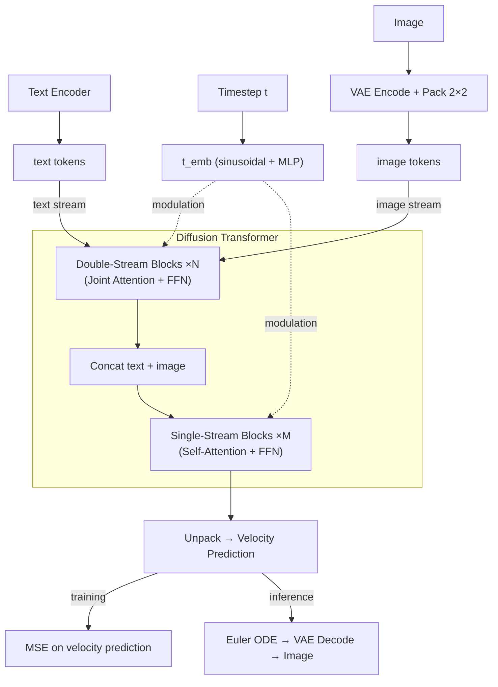

# minFLUX

A minimal implementation of key components of [FLUX](https://bfl.ai/models/flux-2) diffusion transformers. minFLUX tries to be small, clean, interpretable and educational. Since the design space of diffusion models is huge, the purpose of minFLUX is to understand the key model choices in FLUX.

minFLUX is inferred from the official [diffusers](https://github.com/huggingface/diffusers/tree/cbf4d9a3c384ef97d6b0e40c9846dd9e0e41886a) repo. Each `.py` file in `flux1/` and `flux2/` has a `.md` file mapping the code to the exact source lines. This makes minFLUX unique and credible by referencing the official diffusers code.

## Key Equations

**Training** (rectified flow matching):

$$x_t = (1 - \sigma(t)) \cdot x_0 + \sigma(t) \cdot \epsilon \qquad \text{(noisy input)}$$

$$v = \epsilon - x_0 \qquad \text{(velocity prediction)}$$

$$L = \left\| model(x_t, t) - v \right\|^2 \qquad \text{(MSE loss)}$$

**Inference** (Euler ODE step):

$$x_{t_{\text{next}}} = x_t + (\sigma(t_{\text{next}}) - \sigma(t)) \cdot model(x_t, t)$$

## Architecture

Block details: [FLUX.1 double/single-stream blocks](flux1/model.md#key-design-choices) | [FLUX.2 block differences](flux2/model.md)

## FLUX.1 vs FLUX.2

| | FLUX.1 | FLUX.2 |
|---|--------|--------|
| Text encoder | CLIP + T5 | Mistral3 |
| VAE norm | shift/scale | BatchNorm |
| FFN | GELU | SwiGLU |
| Modulation | Per-block AdaLN | Shared across blocks |
| RoPE | theta=10000, 3 axes | theta=2000, 4 axes |
| Blocks | 19 double + 38 single | 8 double + 48 single |

## Contributing

Contributions are welcome, especially for:

- **Source-of-truth**: cross-reference code against the [diffusers](https://github.com/huggingface/diffusers) and fix any implementation discrepancies
- **Documentation**: improve the companion `.md` files and update line mappings when diffusers changes
- **New architectures**: add new FLUX variants following the `flux1/` / `flux2/` pattern (each `.py` with a companion `.md`)

## Disclaimer

Since minFLUX is inferred from the official diffusers repo, the possible sources of inaccuracies in the code can be:

- **AI-assisted**: The code is written with the help of AI, referencing the diffusers repo. It was verified line-by-line against the source but not executed end-to-end.
- **Diffusers code changes**: Source-of-truth line numbers reference a specific [commit](https://github.com/huggingface/diffusers/tree/cbf4d9a3c384ef97d6b0e40c9846dd9e0e41886a). The diffusers codebase changes frequently, so functions may move, rename, or change signature.
- **Simplifications**: Stripping ControlNet, IP-Adapter, gradient checkpointing, KV caching, FSDP/DeepSpeed support, and the attention processor dispatch pattern may introduce subtle incompatibilities with pretrained weights. Hence this will not work with pretrained weights. Also the minimal model classes (`flux1/model.py`, `flux2/model.py`) use different attribute names than diffusers' `FluxTransformer2DModel` / `Flux2Transformer2DModel`, so `state_dict` keys will not match directly.
- **FLUX.2 is new**: The FLUX.2 architecture was added to diffusers recently and may still be evolving. The Flux2 files here reflect a snapshot of the codebase at the time of writing.

For verification, cross-reference with the [diffusers source](https://github.com/huggingface/diffusers/tree/cbf4d9a3c384ef97d6b0e40c9846dd9e0e41886a) and the companion `.md` files for the line mappings.
