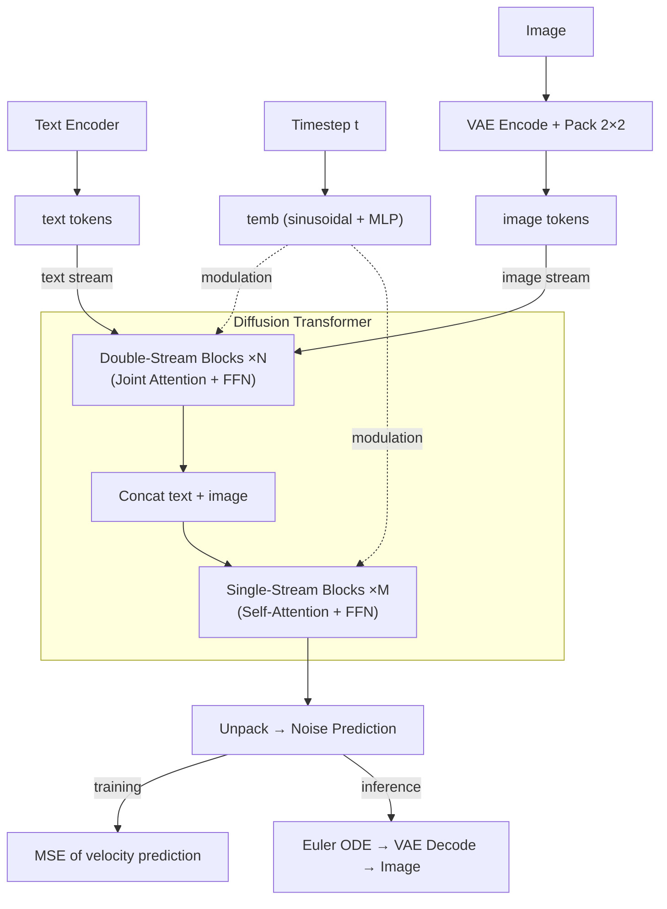

# minFLUX


A minimal implementation of some important components of [FLUX](https://bfl.ai/models/flux-2) diffusion transformers. minFLUX tries to be small, clean, interpretable and educational. Since the design space of diffusion models is huge, the purpose of minFLUX is to understand the key model choices in FLUX.

The `.py` files in `flux1/` and `flux2/` have companion `.md` files, containing documentation and source-of-truth line mappings to the [diffusers](https://github.com/huggingface/diffusers/tree/cbf4d9a3c384ef97d6b0e40c9846dd9e0e41886a) repo. These `.md` files are to help understand and verify the code.

## Key Equations

**Training** (rectified flow matching):
```
noisy = (1 - sigma) * data + sigma * noise       # linear interpolation
target = noise - data                              # velocity
loss = MSE(model(noisy, t), target)               # weighted MSE
```

**Inference** (Euler ODE step):
```
x_{t-1} = x_t + (sigma_next - sigma) * model(x_t, t)
```

## Architecture



## FLUX.1 vs FLUX.2

| | FLUX.1 | FLUX.2 |
|---|--------|--------|
| Text encoder | CLIP + T5 | Mistral3 |
| VAE norm | shift/scale | BatchNorm |
| FFN | GELU | SwiGLU |
| Modulation | Per-block AdaLN | Shared across blocks |
| RoPE | theta=10000, 3 axes | theta=2000, 4 axes |
| Blocks | 19 double + 38 single | 8 double + 48 single |

## Contributing

Contributions welcome — especially:

- **Accuracy fixes**: cross-reference code against the [diffusers](https://github.com/huggingface/diffusers) and fix discrepancies
- **Documentation**: improve the companion `.md` files and update line mappings when diffusers changes
- **New architectures**: add new FLUX variants following the `flux1/` / `flux2/` pattern (each `.py` with a companion `.md`)

Please keep code minimal, self-explanatory, and verified against the diffusers source code.

## Warning

This implementation of FLUX.1 and FLUX.2 is inferred from the diffusers repo and may contain errors. Possible sources of inaccuracy include:

- **AI-assisted**: The code is written with the help of AI, referencing the diffusers repo. It was verified line-by-line against the source but not executed end-to-end. This means that the code may contain errors.
- **Diffusers code changes**: Source-of-truth line numbers reference a specific [commit](https://github.com/huggingface/diffusers/tree/cbf4d9a3c384ef97d6b0e40c9846dd9e0e41886a). The diffusers codebase changes frequently, so functions may move, rename, or change signature.
- **Simplifications**: Stripping ControlNet, IP-Adapter, gradient checkpointing, KV caching, FSDP/DeepSpeed support, and the attention processor dispatch pattern may introduce subtle incompatibilities with pretrained weights. Hence this will not work with pretrained weights. Also the minimal model classes (`flux1/model.py`, `flux2/model.py`) use different attribute names than diffusers' `FluxTransformer2DModel` / `Flux2Transformer2DModel`, so `state_dict` keys will not match directly.
- **FLUX.2 is new**: The FLUX.2 architecture was added to diffusers recently and may still be evolving. The Flux2 files here reflect a snapshot of the codebase at the time of writing.

For verification, cross-reference with the [diffusers source](https://github.com/huggingface/diffusers/tree/cbf4d9a3c384ef97d6b0e40c9846dd9e0e41886a) and the companion `.md` files for the line mappings.
