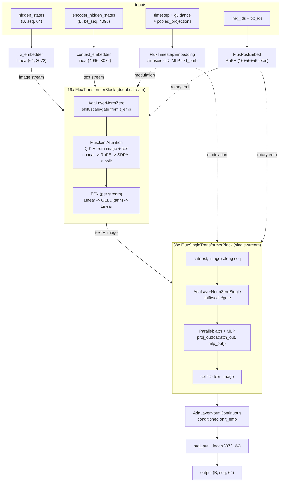

# Flux Transformer Model Documentation

## Overview

The complete FLUX.1 transformer architecture in one file (~270 lines).

This file defines `FluxJointAttention + FluxTransformerBlock + FluxTransformer2DModel` using `nn.Linear`, `nn.LayerNorm`, `nn.RMSNorm`, and `F.scaled_dot_product_attention`.

## Architecture

### Key Design Choices

- **Double-stream blocks** ([`FluxTransformerBlock`](model.py#L199)): Text and image have separate attention norms, separate FFN paths, but share a single joint attention computation. This allows cross-modal attention while maintaining modality-specific processing.
- **Single-stream blocks** ([`FluxSingleTransformerBlock`](model.py#L227)): Text and image tokens are concatenated and processed together. Attention and MLP run in parallel (not sequential) and are projected out together.
- **AdaLN-Zero modulation**: Timestep + guidance + text embeddings modulate every block via shift/scale/gate parameters.
- **RoPE**: Rotary positional embeddings applied per-axis (16+56+56 = 128 = head_dim) to queries and keys.

### Default Config (FLUX.1-dev)

| Parameter | Value |
|-----------|-------|
| `in_channels` | 64 |
| `num_layers` (double-stream) | 19 |
| `num_single_layers` | 38 |
| `num_attention_heads` | 24 |
| `attention_head_dim` | 128 |
| `inner_dim` | 3072 |
| `joint_attention_dim` | 4096 |
| `pooled_projection_dim` | 768 |
| `axes_dims_rope` | (16, 56, 56) |
| Parameters | ~12B |

---

## Source of Truth

### Canonical Source Files

| Short Name | Full Path |
|------------|-----------|
| `transformer_flux` | [`src/diffusers/models/transformers/transformer_flux.py`](https://github.com/huggingface/diffusers/blob/cbf4d9a3c384ef97d6b0e40c9846dd9e0e41886a/src/diffusers/models/transformers/transformer_flux.py) |
| `embeddings` | [`src/diffusers/models/embeddings.py`](https://github.com/huggingface/diffusers/blob/cbf4d9a3c384ef97d6b0e40c9846dd9e0e41886a/src/diffusers/models/embeddings.py) |
| `normalization` | [`src/diffusers/models/normalization.py`](https://github.com/huggingface/diffusers/blob/cbf4d9a3c384ef97d6b0e40c9846dd9e0e41886a/src/diffusers/models/normalization.py) |
| `attention` | [`src/diffusers/models/attention.py`](https://github.com/huggingface/diffusers/blob/cbf4d9a3c384ef97d6b0e40c9846dd9e0e41886a/src/diffusers/models/attention.py) |
| `activations` | [`src/diffusers/models/activations.py`](https://github.com/huggingface/diffusers/blob/cbf4d9a3c384ef97d6b0e40c9846dd9e0e41886a/src/diffusers/models/activations.py) |

### Line-by-Line Mapping

| minFLUX class | Canonical Source | Source Lines | Verdict |
|----------------|------------------|--------------|---------|
| `TextProjection` | `embeddings.PixArtAlphaTextProjection` | 2191-2217 | MATCH (act_fn="silu" hardcoded) |
| `FluxTimestepEmbedding` | `embeddings.CombinedTimestepGuidanceTextProjEmbeddings` | 1603-1624 | MATCH (merged guidance/no-guidance variants) |
| `AdaLayerNormZero` | `normalization.AdaLayerNormZero` | 130-170 | MATCH (stripped num_embeddings, norm_type options) |
| `AdaLayerNormZeroSingle` | `normalization.AdaLayerNormZeroSingle` | 173-202 | EXACT MATCH (logic) |
| `FluxJointAttention` | `transformer_flux.FluxAttention` (double-stream) | 275-352 | MATCH (stripped processor dispatch, IP-adapter) |
| `FluxSingleAttention` | `transformer_flux.FluxAttention` (pre_only=True) | 275-352 | MATCH (pre_only variant) |
| `FluxTransformerBlock` | `transformer_flux.FluxTransformerBlock` | 409-491 | MATCH (stripped ControlNet residual) |
| `FluxSingleTransformerBlock` | `transformer_flux.FluxSingleTransformerBlock` | 355-406 | EXACT MATCH (logic) |
| `FluxTransformer2DModel.__init__` | `transformer_flux.FluxTransformer2DModel.__init__` | 579-635 | MATCH (stripped patch_size, out_channels, grad ckpt) |
| `FluxTransformer2DModel.forward` | `transformer_flux.FluxTransformer2DModel.forward` | 637-778 | MATCH (stripped ControlNet, IP-adapter, grad ckpt) |
| FeedForward (inline `nn.Sequential`) | `attention.FeedForward` with `gelu-approximate` | 1696-1742 | MATCH (inlined as Linear->GELU->Linear) |

### What Was Stripped

- **ControlNet residual hooks** (`controlnet_block_samples`, `controlnet_single_block_samples`)
- **IP-Adapter projection** (`encoder_hid_proj`, `ip_adapter_image_embeds`)
- **Gradient checkpointing** (`_gradient_checkpointing_func`)
- **Attention processor dispatch** (FluxAttnProcessor pattern replaced with direct `F.scaled_dot_product_attention`)
- **ConfigMixin / ModelMixin / PeftAdapterMixin** (diffusers infrastructure)
- **fp16 overflow clipping** (`clip(-65504, 65504)`)
- **Fused QKV projections** (`fused_projections` path)
